# llama-orchestrator Project Analysis

> **Version:** 2.1.0  
> **Author:** MichaelPrinc  
> **Analysis Date:** 2026-07-06  
> **Workspace Path:** `k:\Data_science_projects\WireGuard\infra-local\llama-orchestrator\`

---

## 1. Project Overview

**llama-orchestrator** is a Python-based control plane for managing multiple [`llama.cpp`](https://github.com/ggml-org/llama.cpp) server instances on Windows. It provides a `docker-compose`-style operator experience — `init`, `up`, `down`, `ps`, `logs`, `dashboard`, and `gui` — backed by native Windows process management, SQLite state persistence, and a rich desktop GUI.

The project is a first-class local infrastructure component within the WireGuard workspace, serving as the primary orchestration layer for local LLM inference servers.

### Key Capabilities

| Capability | Description |
|---|---|
| 🚀 **Multi-instance orchestration** | Run multiple `llama-server` processes on different ports, each with its own model, GPU binding, and runtime args |
| 🔄 **Health monitoring** | Configurable HTTP/TCP/custom probes with retry/backoff and jittered restart delays |
| ♻️ **Auto-restart** | Background daemon with exponential-backoff restart on failure |
| 📊 **TUI Dashboard** | Live terminal dashboard with recent events panel and instance filtering |
| 🪟 **Desktop GUI** | Windows Tkinter management panel — model table, tag filtering, batch actions, inline runtime args editing, benchmark controls |
| 🔧 **Binary management** | Versioned `llama-server` packages under `bins/`, UUID registry, per-instance binary pinning |
| 🛡️ **Windows service** | NSSM-backed daemon install/uninstall for persistent background operation |
| 📈 **Benchmark harness** | Quick, serial, grid, and prompt-based benchmark workflows with TTFT / throughput / cache-reuse telemetry |
| 📝 **Audit logging** | File-based rotating logs, `logs -f` streaming, event log in SQLite |

---

## 2. Architecture Overview

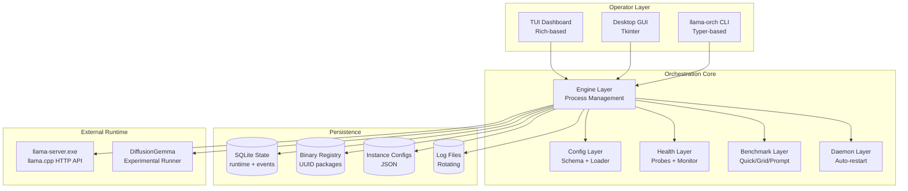

---

## 3. Component Deep Dive

### 3.1 CLI Interface (`cli.py`)

The CLI is built with **Typer** and provides a Docker-like command surface:

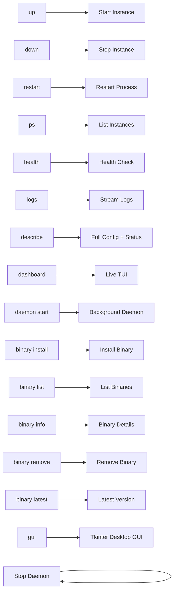

**Exit Code Standards:**
- `2` — Usage errors
- `10-19` — Configuration errors
- `20-39` — Instance/process errors
- `50-69` — Binary/daemon errors

### 3.2 Engine Layer (`engine/`)

The engine layer is the core orchestration engine, handling process lifecycle:

```mermaid
graph TB
    subgraph "Process Lifecycle"
        START[Start Process] --> BUILD[Build Command]
        BUILD --> ENV[Build Environment]
        ENV --> DETACH[Detached Start]
        DETACH --> LOCK[Instance Locking]
        LOCK --> LOG[Log Config]
        LOG --> RUN[Run Process]
        RUN --> STATE[Update State]
    end

    subgraph "State Management"
        LOAD[Load State] --> VALIDATE[Validate]
        VALIDATE --> SAVE[Save State]
        SAVE --> RECONCILE[Reconcile]
    end

    subgraph "Error Handling"
        CATCH[Catch Errors] --> LOG_ERR[Log Error]
        LOG_ERR --> RECOVER[Attempt Recovery]
    end
```

**Key Modules:**
| Module | Purpose |
|---|---|
| `command.py` | Build command strings, environment variables, validate executables |
| `detach.py` | Detached process startup for background operation |
| `detection.py` | Backend/device detection, runtime description |
| `locking.py` | Per-instance file-based locking to prevent race conditions |
| `logging_config.py` | Instance-specific rotating log handlers |
| `state.py` | SQLite V2 schema, runtime state, event log, health history |
| `validator.py` | Process validation, state integrity checks |
| `process.py` | Main process management, start/stop/restart logic |

### 3.3 Configuration Layer (`config/`)

Configuration management with Pydantic models and schema validation:

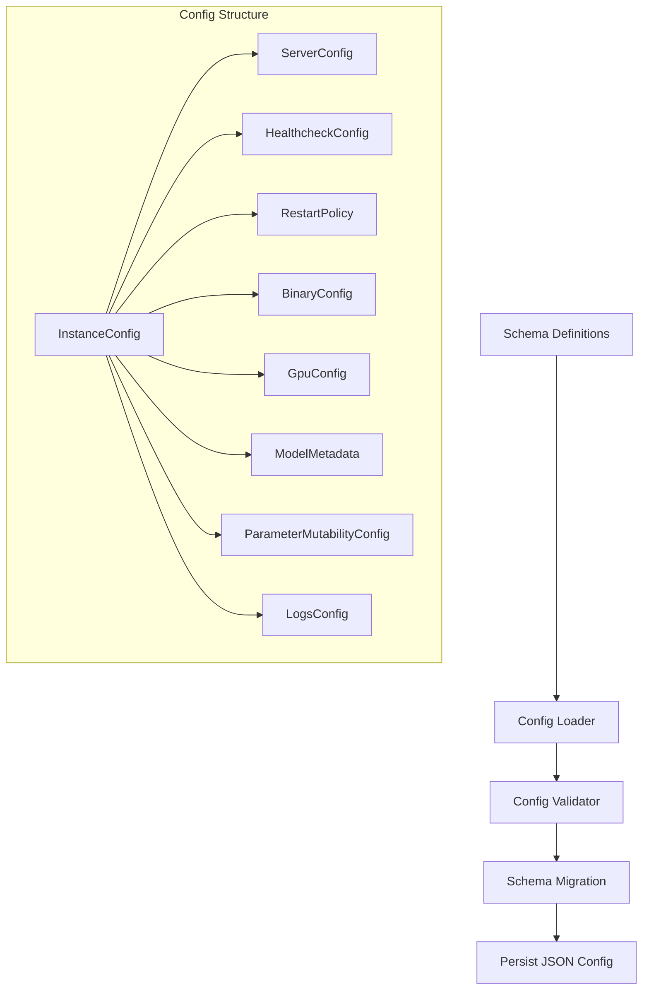

**Key Data Models:**
- `InstanceConfig` — Top-level instance definition
- `ServerConfig` — HTTP server settings (port, host, model path)
- `HealthcheckConfig` — Probe configuration (HTTP/TCP/custom)
- `RestartPolicy` — Exponential backoff settings
- `BinaryConfig` — Versioned llama.cpp binary pinning
- `GpuConfig` — GPU device binding and layer counts
- `ModelMetadata` — GGUF-extracted model metadata
- `ParameterMutabilityConfig` — Runtime parameter mutability flags

### 3.4 Health Layer (`health/`)

Pluggable health probe system with retry/backoff:

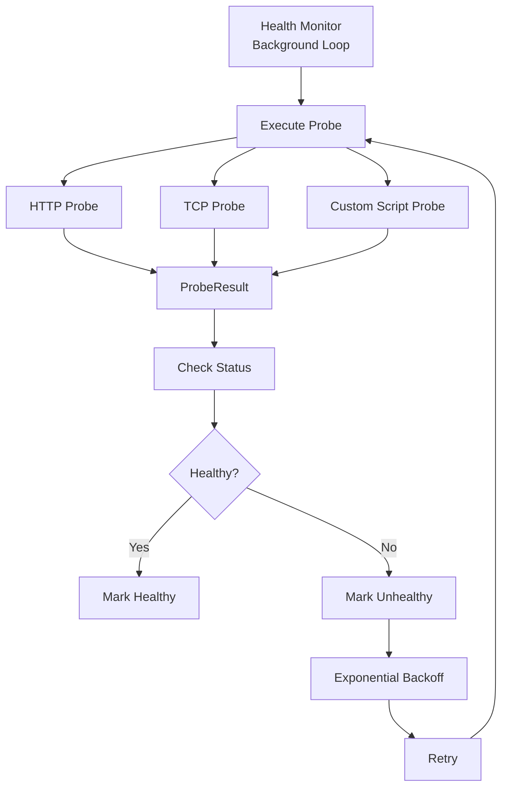

**Probe Types:**
| Type | Description |
|---|---|
| `HTTP` | HTTP GET with status code validation |
| `TCP` | Raw socket connection check |
| `CUSTOM` | Script-based custom probe (with security sandboxing) |

**Security Modes for Custom Probes:**
- `DISABLED` — Custom probes blocked
- `RESTRICTED` — Restricted execution environment
- `SANDBOXED` — Sandboxed execution with resource limits

### 3.5 Benchmark Layer (`benchmark.py`, `benchmark_grid.py`)

Benchmark harness for performance telemetry:

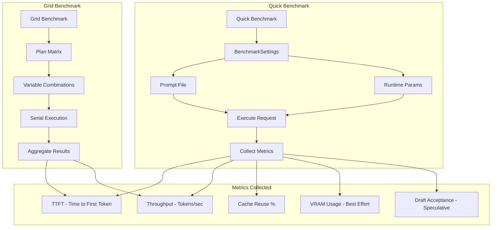

### 3.6 Desktop GUI (`gui/`)

Tkinter-based Windows desktop management panel:

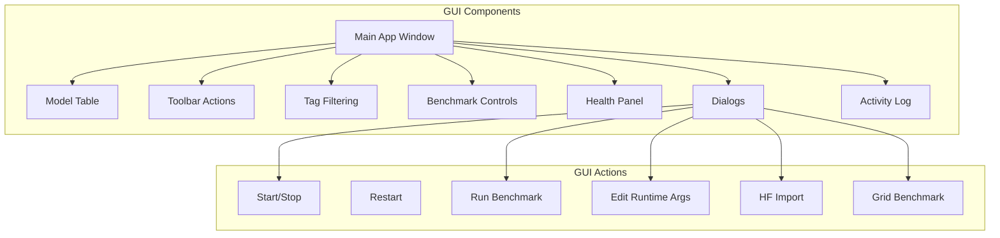

### 3.7 Binary Management (`bins/`)

Versioned binary package management with UUID registry:

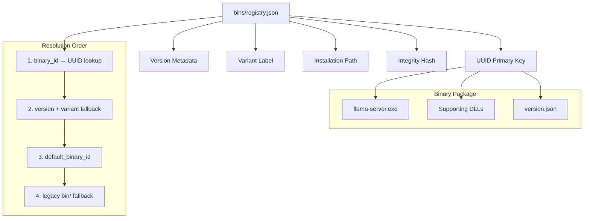

### 3.8 Daemon Layer (`daemon/`)

Background daemon with auto-restart:

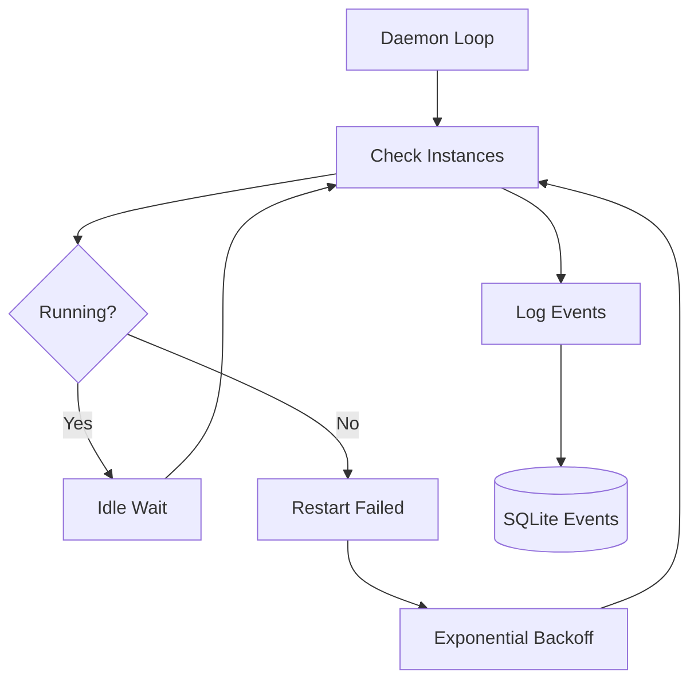

---

## 4. Data Flow

### 4.1 Instance Start Flow

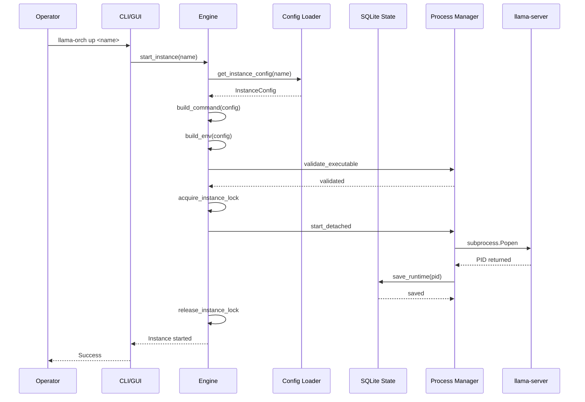

### 4.2 Health Check Flow

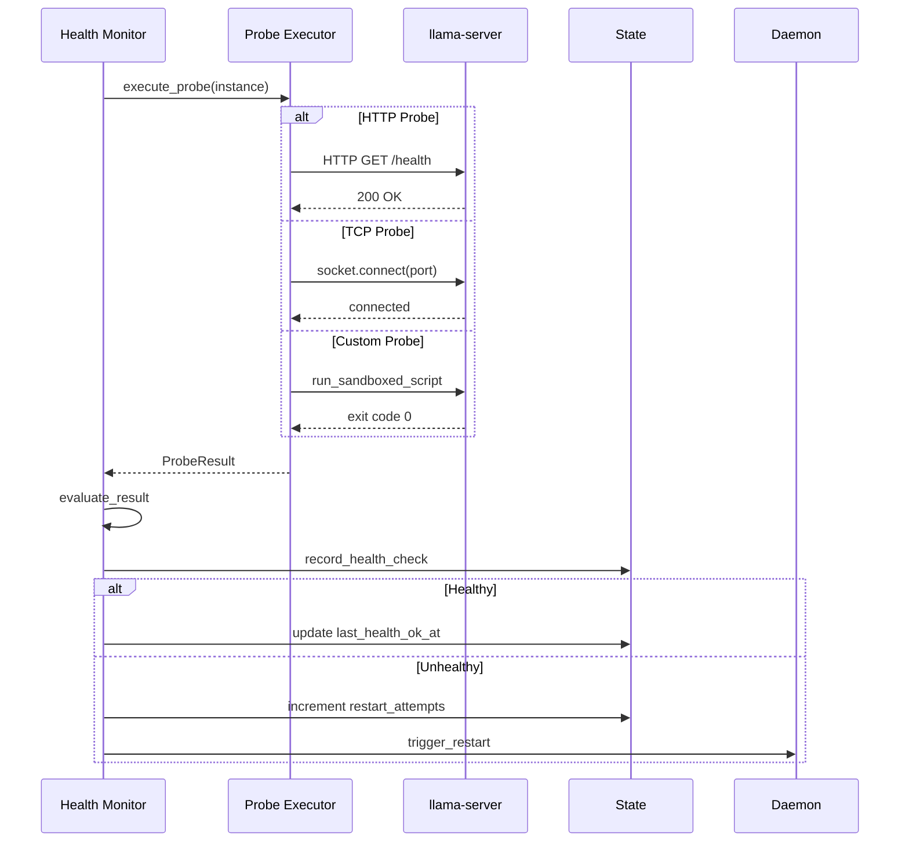

### 4.3 Benchmark Flow

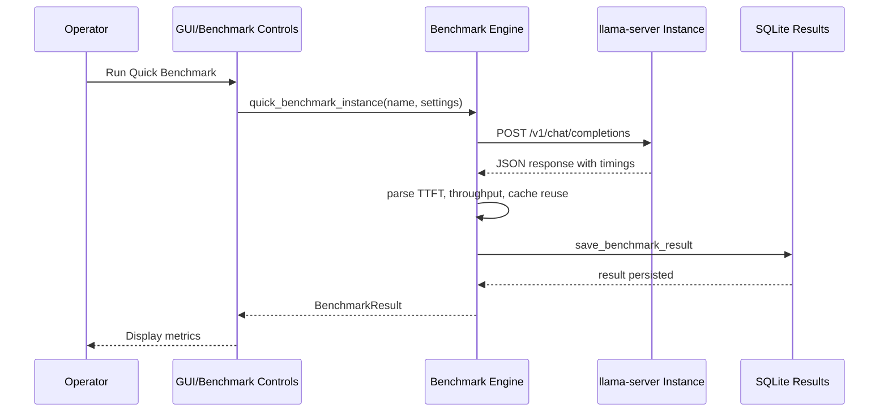

---

## 5. Project Structure

```mermaid
graph TB
    subgraph "llama-orchestrator"
        SRC[src/llama_orchestrator]
        BINS[bins/ - Binary Packages]
        INSTANCES[instances/ - Instance Configs]
        STATE[state/ - Runtime State]
        LOGS[logs/ - Log Files]
        MODELS[models/ - Model Files]
        BENCHMARKS[benchmarks/ - Benchmark Artifacts]
        DOCS[docs/ - Documentation]
        SCRIPTS[scripts/ - PowerShell Helpers]
        TESTS[tests/ - Test Suite]
        TMP[tmp/ - Temporary Files]
        BINS_REG[bins/registry.json]
    end

    SRC --> CLI[cli.py]
    SRC --> ENGINE[engine/]
    SRC --> CONFIG[config/]
    SRC --> HEALTH[health/]
    SRC --> BENCH[benchmark.py]
    SRC --> GUI[gui/]
    SRC --> DAEMON[daemon/]
    SRC --> HF[hf_import.py]
    SRC --> MEMFIT[memory_fit.py]
    SRC --> DIFF[diffusion_http_adapter.py]

    ENGINE --> PROC[process.py]
    ENGINE --> STATE_MGMT[state.py]
    ENGINE --> CMD[command.py]
    ENGINE --> LOCK[locking.py]
    ENGINE --> LOG_CFG[logging_config.py]
    ENGINE --> DETACH[detach.py]
    ENGINE --> DET[ detection.py]
    ENGINE --> VAL[validator.py]

    CONFIG --> LOADER[loader.py]
    CONFIG --> SCHEMA[schema.py]
    CONFIG --> VALID[validator.py]

    HEALTH --> PROB[probes.py]
    HEALTH --> CHK[checker.py]
    HEALTH --> POOL[client_pool.py]
    HEALTH --> MON[monitor.py]
    HEALTH --> PORT[ports.py]
    HEALTH --> BK[backoff.py]

    BINS --> REG[bins/registry.json]
    BINS --> UUID[bins/<uuid>/]

    INSTANCES --> IC[instances/<name>/config.json]

    STATE --> SQLITE[state/state.sqlite]
```

---

## 6. State Machine

### 6.1 Instance Lifecycle

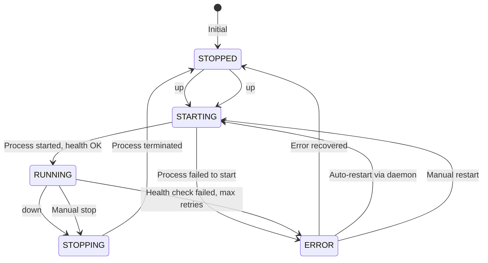

### 6.2 Health Status Transitions

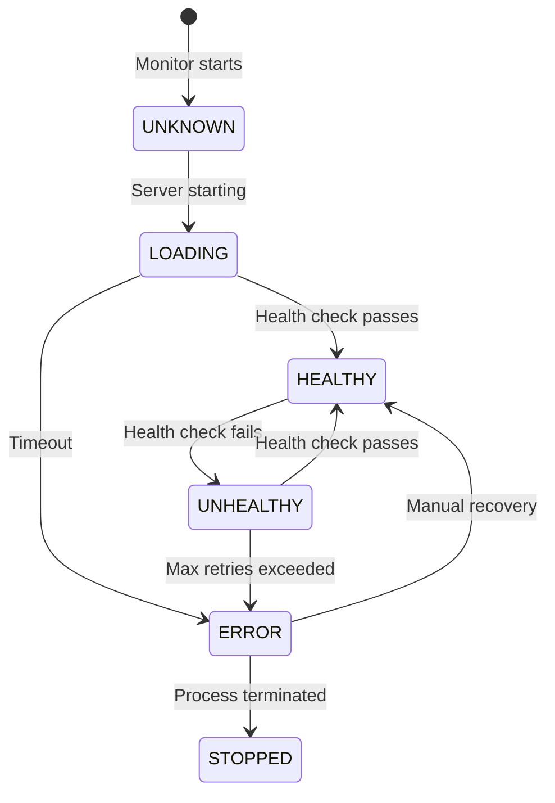

---

## 7. Technology Stack

| Component | Technology | Purpose |
|---|---|---|
| **CLI Framework** | Typer [all] | Command-line interface |
| **UI Framework** | Tkinter (stdlib) | Desktop GUI |
| **TUI** | Rich >= 13.7 | Terminal dashboard |
| **HTTP Client** | httpx >= 0.25 | Health probes, benchmark requests |
| **Process Management** | psutil >= 5.9 | Process monitoring, resource tracking |
| **Database** | aiosqlite >= 0.19 | SQLite state persistence |
| **Data Validation** | Pydantic >= 2.5 | Config schema, model validation |
| **Model Import** | huggingface_hub >= 0.32 | GGUF model download/import |
| **Secrets** | keyring >= 25.6 | Credential management |
| **Runtime** | llama.cpp | C++ inference server (llama-server.exe) |

---

## 8. Version History & Scope

### Current Version: 2.1.0

**Shipped Features:**
- V2 SQLite state schema (runtime + events tables)
- Explicit persisted parameter mutability metadata
- Warning-level validation for wide network binding (0.0.0.0)
- Process and state reliability (per-instance locking, stale-state reconciliation)
- Daemon and logging reliability (file-based rotating logs, `logs -f`)
- Health and restart behavior (configurable probes, jittered restart delays)
- CLI and dashboard UX (standard exit codes, recent events panel)
- Desktop GUI and benchmark workflows (Tkinter panel, grid benchmarks)
- Binary management (UUID registry, per-instance pinning)
- NSSM-backed Windows service install/uninstall
- GGUF metadata extraction and GPU memory fit estimation
- DiffusionGemma HTTP adapter (experimental)

**Known Remaining Gaps:**
- Manual Windows Services UI smoke testing needed on target hosts with `nssm.exe`
- Several binary-management convenience commands listed as future work
- GUI column visibility, tag filter, and window geometry are intentionally session-local
- Dedicated TTFT or cache trend dashboards not yet implemented
- MCP gateway integration not yet implemented
- llama-swap export not yet implemented

---

## 9. Integration Points

### 9.1 Workspace Integration

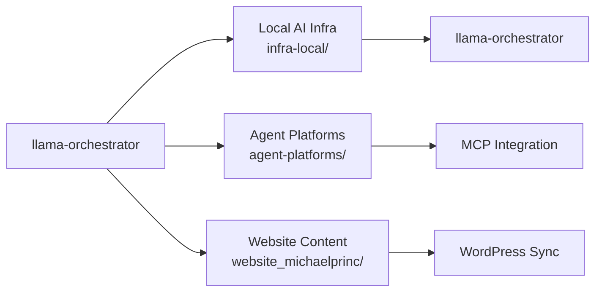

### 9.2 MCP Server Integration

The project integrates with the workspace's MCP (Model Context Protocol) infrastructure:
- SSH MCP servers for remote GCP1/OCI1 operations
- PowerShell MCP Script Quality server for code analysis
- Cloudflare MCP for DNS/cache operations

### 9.3 PowerShell Automation

PowerShell helper scripts under `scripts/`:
- `Install-AutostartTask.ps1` — Task Scheduler integration
- `install-service.ps1` — NSSM Windows service installation
- `llama.ps1` — Legacy launcher wrapper
- `Start-Autostart.ps1` — Autostart orchestration

---

## 10. Security Considerations

| Area | Consideration |
|---|---|
| **Custom Probes** | Security sandboxing with DISABLED/RESTRICTED/SANDBOXED modes |
| **Binary Integrity** | SHA256 hash validation in registry |
| **Instance Locking** | File-based locking prevents race conditions |
| **Network Binding** | Warning-level validation for 0.0.0.0 binding |
| **Process Isolation** | Detached process startup with separate stdio |
| **Credential Storage** | keyring integration for secrets management |

---

## 11. Testing Strategy

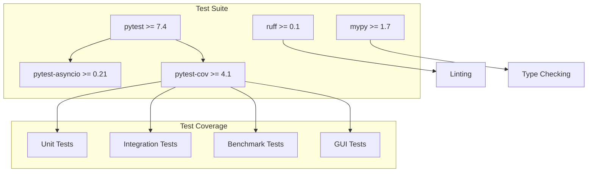

**Configuration:**
- Test paths: `tests/`
- Asyncio mode: `auto`
- Coverage source: `src/llama_orchestrator`
- Branch coverage enabled

---

## 12. Operational Runbook Summary

### Common Operations

| Operation | Command |
|---|---|
| List instances | `llama-orch ps` |
| Start instance | `llama-orch up <name>` |
| Stop instance | `llama-orch down <name>` |
| Restart instance | `llama-orch restart <name>` |
| Check health | `llama-orch health <name>` |
| View logs | `llama-orch logs <name>` |
| Show config | `llama-orch describe <name>` |
| Launch GUI | `llama-orch gui` |
| Launch TUI | `llama-orch dashboard` |
| Install binary | `llama-orch binary install` |
| List binaries | `llama-orch binary list` |
| Start daemon | `llama-orch daemon start` |
| Stop daemon | `llama-orch daemon stop` |

### State Locations

| State | Path |
|---|---|
| Runtime State | `state/state.sqlite` |
| Instance Configs | `instances/<name>/config.json` |
| Binary Registry | `bins/registry.json` |
| Log Files | `logs/<instance>.log` |
| Benchmark Results | `benchmarks/latest_<instance>.json` |

---

## 13. Future Roadmap (Based on Known Gaps)

1. **Windows Services UI Smoke Testing** — Manual validation on target hosts
2. **Binary Management Convenience Commands** — Additional CLI workflows
3. **GUI Session Persistence** — Column visibility, tag filter, window geometry
4. **Dedicated TTFT Dashboard** — Time-to-first-token trend visualization
5. **Cache Reuse Dashboard** — Cache trend monitoring and reporting
6. **MCP Gateway Integration** — Model Context Protocol server integration
7. **llama-swap Export** — Export capabilities for llama-swap compatibility

---

## 14. File Summary

| Category | Files | Purpose |
|---|---|---|
| **CLI** | `cli.py`, `cli_describe.py`, `cli_exit_codes.py` | Command-line interface |
| **Engine** | `process.py`, `state.py`, `command.py`, `locking.py`, `detach.py`, `detection.py`, `validator.py`, `logging_config.py` | Core orchestration |
| **Config** | `schema.py`, `loader.py`, `validator.py` | Configuration management |
| **Health** | `probes.py`, `checker.py`, `client_pool.py`, `monitor.py`, `ports.py`, `backoff.py` | Health monitoring |
| **GUI** | `app.py`, `table.py`, `toolbar.py`, `dialogs.py`, `benchmark_controls.py`, `grid_benchmark_dialog.py`, `kv_cache_dialogs.py`, `model_dialogs.py`, `gpu_inventory.py`, `activity_log.py`, `row_renderer.py`, `refresh.py`, `usability.py`, `actions.py`, `dataclasses.py`, `metadata_cache.py`, `install_dialog.py`, `hf_import_dialog.py`, `grid_dialogs.py` | Desktop management panel |
| **Benchmark** | `benchmark.py`, `benchmark_grid.py` | Performance telemetry |
| **Daemon** | Background auto-restart loop | Process supervision |
| **Utilities** | `hf_import.py`, `memory_fit.py`, `diffusion_http_adapter.py` | Model import, GPU fit, diffusion adapter |
| **Scripts** | PowerShell helpers | Autostart, service installation |
| **Docs** | `docs/*.md` | Implementation plans, checklists, analysis |
| **Tests** | `tests/` | Test suite |

---

*Analysis generated: 2026-07-06*  
*Source: `infra-local/llama-orchestrator/` — Version 2.1.0*
